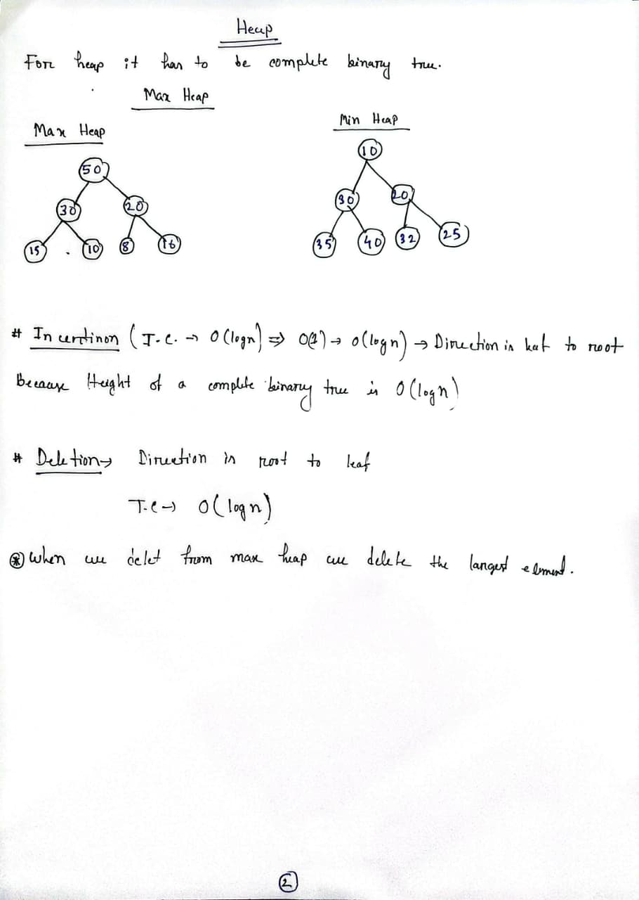
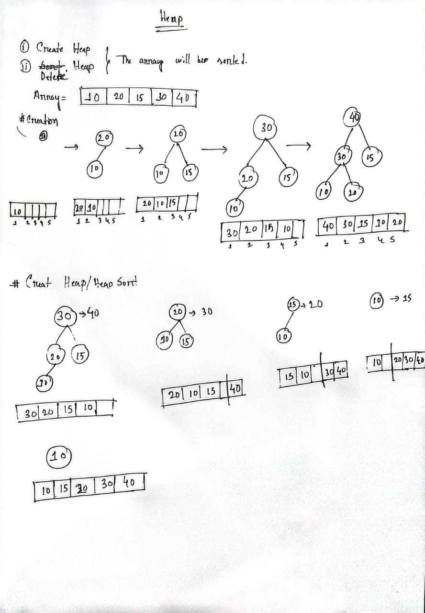
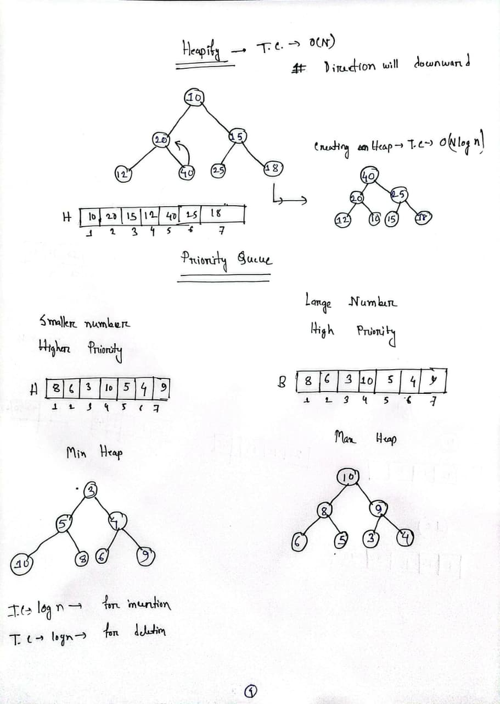

# Heap Sort Visualization

This document displays the step-by-step visualization of the Heap Sort algorithm.

---

## Step 1: Initial Heap

---

## Step 2: Building the Heap

---

## Step 3: Heap Sorting Process

---

## Heapify and Priority Queue

---

## How Heap Sort Works

Heap Sort is a comparison-based sorting algorithm that uses a binary heap data structure. The algorithm consists of two main steps:

1. **Build Max Heap**: Convert the input array into a max heap
2. **Extract Elements**: Repeatedly extract the maximum element and place it at the end

### Time Complexity

- **Best Case**: O(n log n)
- **Average Case**: O(n log n)
- **Worst Case**: O(n log n)

### Space Complexity

- O(1) - Sorts in place

### Key Characteristics

- ✓ In-place sorting
- ✓ Not stable
- ✓ Not adaptive
- ✓ Good for large datasets
