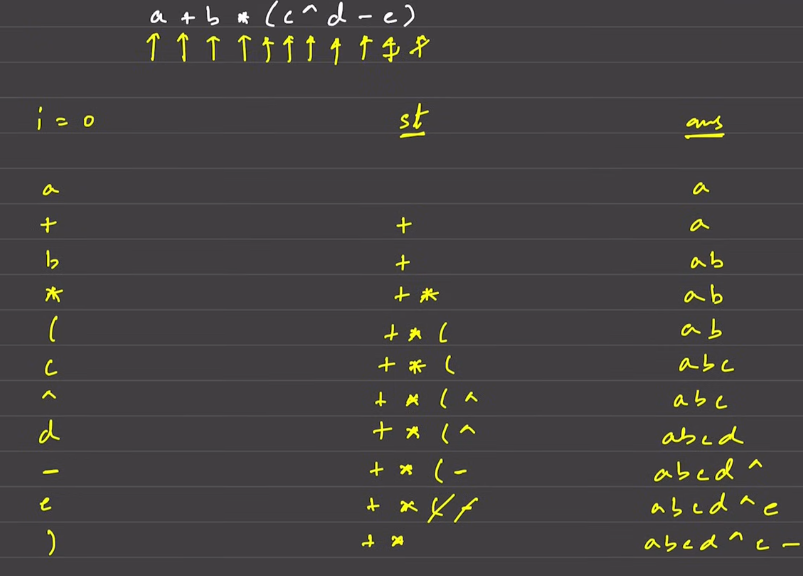

# Infix to Postfix Conversion

`Infix` notation is the common arithmetic and logical formula notation, where operators are written between the operands. For example, `A + B` is an infix expression.

`Postfix` notation, also known as Reverse Polish Notation (RPN), is a mathematical notation in which every operator follows all of its operands. For example, the infix expression `A + B` would be written as `A B +` in postfix notation.

