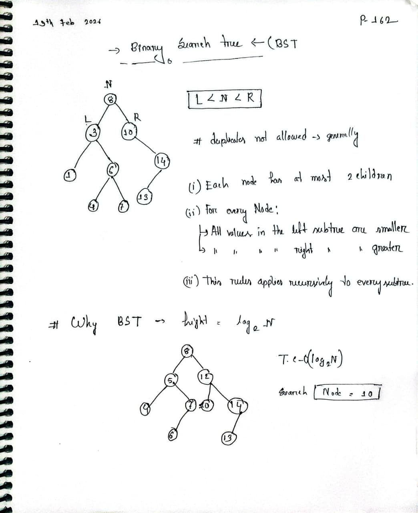

# Binary Search Tree (BST)

## Definition

A **Binary Search Tree** is a binary tree data structure where each node has at most two children (left and right). The key property that distinguishes a BST from a regular binary tree is that:

- **All values in the left subtree are less than the node's value**
- **All values in the right subtree are greater than the node's value**
- This property holds recursively for all subtrees

## Visual Representation

### BST Structure Example



## Why Use Binary Search Trees?

### 1. **Efficient Searching**

- **Time Complexity**: O(log n) on average for balanced BSTs
- Unlike linear search in unsorted arrays which is O(n)
- Each comparison eliminates half of the remaining candidates
- Similar to binary search but on a dynamic data structure

### 2. **Dynamic Operations**

- Insertion and deletion are more efficient than sorted arrays
- Arrays require shifting elements, which is O(n)
- **BST Operations**:
  - Average case: O(log n)
  - Worst case: O(n) for skewed trees

### 3. **Sorted Order Access**

- In-order traversal gives elements in sorted order
- No need to sort data separately
- **Time**: O(n) to get all elements in order

### 4. **Range Queries**

- Finding all elements within a range [L, R] is efficient
- Example: Find all values between 5 and 15
- More efficient than scanning entire array

### 5. **Memory Efficiency**

- No need to keep entire array sorted in memory
- Can insert and organize data as it arrives
- Useful for streaming data

### 6. **Database Indexing**

- B-Trees and B+ Trees (variants of BSTs) are used in databases
- Enables fast lookups on disk-based storage
- Balancing ensures consistent O(log n) performance

## BST Properties

| Property           | Description                                                                           |
| ------------------ | ------------------------------------------------------------------------------------- |
| **Balanced BST**   | Height difference between left and right subtrees is ≤ 1, ensures O(log n) operations |
| **Skewed BST**     | Looks like a linked list, degrades to O(n), happens with sorted input                 |
| **Self-Balancing** | AVL Trees, Red-Black Trees automatically maintain balance                             |

## Time Complexity Comparison

| Operation    | Unsorted Array | Sorted Array | Balanced BST | Unbalanced BST |
| ------------ | -------------- | ------------ | ------------ | -------------- |
| Search       | O(n)           | O(log n)     | O(log n)     | O(n)           |
| Insert       | O(1)           | O(n)         | O(log n)     | O(n)           |
| Delete       | O(n)           | O(n)         | O(log n)     | O(n)           |
| Sorted Order | O(n log n)     | O(n)         | O(n)         | O(n)           |

## Core Operations

### 1. Search

```
Recursively compare target with current node:
- If target == node: Found!
- If target < node: Search left subtree
- If target > node: Search right subtree
- If reach null: Element not found
```

### 2. Insertion

```
Find the correct position maintaining BST property:
- Compare new value with nodes from root
- Go left if smaller, right if larger
- Insert at the empty spot
```

### 3. Deletion

Three cases:

- **Leaf node**: Simply remove
- **One child**: Replace with that child
- **Two children**: Replace with in-order successor (smallest in right subtree)

## Advantages of BST

✅ **Efficient searching** - Better than linear search  
✅ **Dynamic structure** - Grows naturally with data  
✅ **Organized data** - Maintains order relationship  
✅ **Foundation for advanced data structures** - AVL, Red-Black Trees  
✅ **InOrder gives sorted sequence** - No extra sorting needed  
✅ **Versatile** - Used in databases, file systems, compilers

## Disadvantages of BST

❌ **No guarantee of balanced structure** - Can degrade to O(n)  
❌ **Not suitable for sequential storage** - Wastes cached memory  
❌ **Extra space for pointers** - Each node needs multiple pointers  
❌ **Cache unfriendly** - Random memory access patterns

## Real-World Applications

1. **Database Indexing** - B-Trees in MySQL, PostgreSQL
2. **File Systems** - Directory structure and file organization
3. **CompilerDesign** - Symbol tables
4. **Graphics Rendering** - Spatial partitioning (BSP Trees)
5. **Gaming** - AI pathfinding and decision trees
6. **AutoComplete** - Trie (variant of BST)
7. **Expression Evaluation** - Expression trees

## Self-Balancing Variants

When a BST becomes unbalanced, self-balancing variants maintain optimal height:

- **AVL Trees** - Strict balance with rotations
- **Red-Black Trees** - Relaxed balance, simpler rotations
- **B-Trees** - Multiple children, used in databases
- **Splay Trees** - Mostly used items brought to root

## When to Use BST

✓ **Dynamic dataset** - Frequent insertions and deletions  
✓ **Need sorted access** - Range queries  
✓ **Memory available** - Can afford pointers  
✓ **Unknown size** - Data arrives in stream  
✓ **Real-time performance** - O(log n) guarantees needed

## When NOT to Use BST

✗ **Static, pre-sorted data** - Use array with binary search  
✗ **Memory constraints** - Arrays are more compact  
✗ **Highly sequential access** - Arrays better for cache  
✗ **Worst-case guaranteed** - Use balanced variants instead

---

**Key Takeaway**: Binary Search Trees provide an elegant balance between **dynamic insertion/deletion** and **efficient searching**, making them fundamental to computer science and a basis for many advanced data structures used in production systems.

**Last Updated**: February 2026
