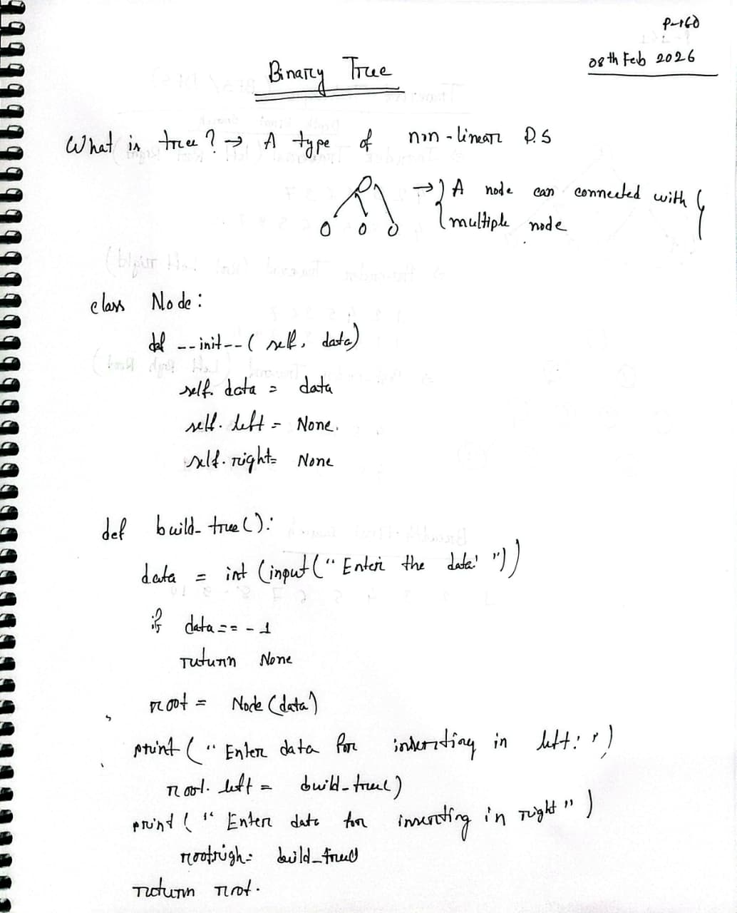
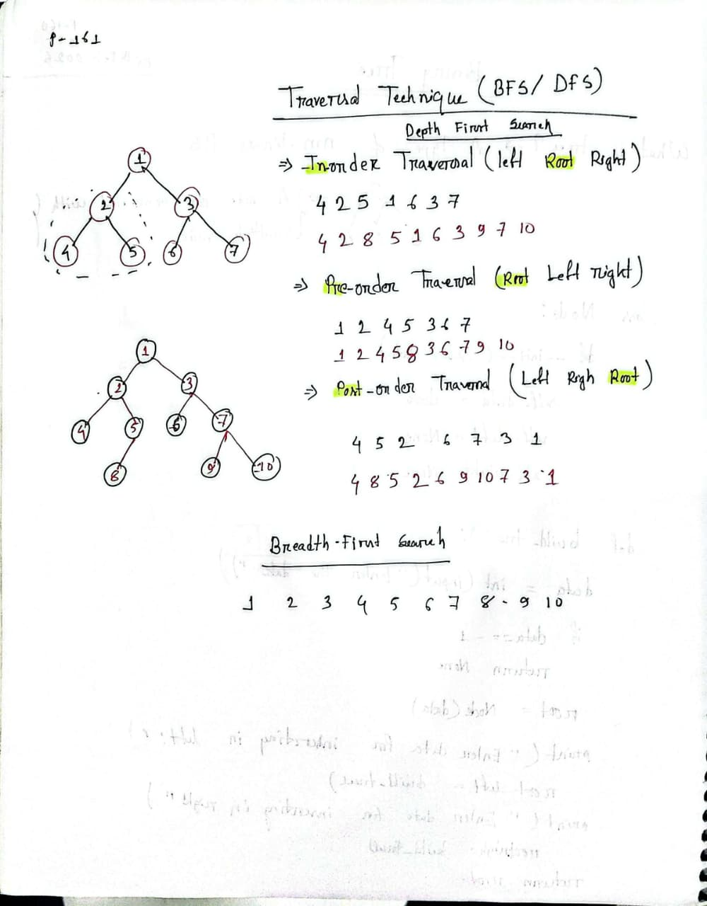

# Binary Tree

## Overview

A binary tree is a hierarchical data structure where each node has at most two children, referred to as the left child and the right child. Binary trees are fundamental data structures used in computer science for various applications including searching, sorting, and implementing other advanced data structures.

## Key Concepts

### Definition

- **Node**: A basic unit containing data and pointers to left and right children
- **Root**: The topmost node of the tree
- **Leaf Node**: A node with no children
- **Height**: The longest path from root to any leaf node
- **Depth**: The distance from root to a specific node

### Types of Binary Trees

1. **Full Binary Tree**: Every node has 0 or 2 children
2. **Complete Binary Tree**: All levels are filled except possibly the last level
3. **Perfect Binary Tree**: All internal nodes have two children and all leaves are at the same level
4. **Balanced Binary Tree**: Height difference between left and right subtrees is at most 1
5. **Binary Search Tree (BST)**: Left child < Parent < Right child

## Binary Tree Structure

### Visual Representation 1



### Visual Representation 2



## Traversal Methods

### Pre-order Traversal

- Visit the node first, then traverse left subtree, then right subtree
- **Order**: Root → Left → Right
- **Use Case**: Creating a copy of the tree

### In-order Traversal

- Traverse left subtree first, then visit node, then traverse right subtree
- **Order**: Left → Root → Right
- **Use Case**: Getting elements in sorted order (for BST)

### Post-order Traversal

- Traverse left subtree, then right subtree, then visit node
- **Order**: Left → Right → Root
- **Use Case**: Deleting the tree

### Level-order Traversal (BFS)

- Visit nodes level by level from top to bottom, left to right
- **Use Case**: Finding shortest path, level-wise operations

## Common Operations

| Operation | Time Complexity | Space Complexity |
| --------- | --------------- | ---------------- |
| Search    | O(n)            | O(h)             |
| Insert    | O(n)            | O(h)             |
| Delete    | O(n)            | O(h)             |
| Traversal | O(n)            | O(h)             |

**Note**: _h_ = height of tree, _n_ = number of nodes

## Python Implementation Files

This repository contains the following implementation files:

- `build-binary-tree.py` - Building a binary tree from input
- `pre-order-traversal.py` - Pre-order traversal implementation
- `in-order-traversal.py` - In-order traversal implementation
- `post-order-traversal.py` - Post-order traversal implementation
- `level-order-traversal.py` - Level-order (BFS) traversal implementation
- `max-depth.py` - Finding maximum depth of a binary tree

## Quick Start

To use any of the Python files, simply run:

```bash
python <filename>.py
```

## Applications

1. **Expression Trees**: Used to evaluate mathematical expressions
2. **Huffman Coding**: Used in data compression
3. **File Systems**: Hierarchical directory structures
4. **DOM Trees**: Web browser representation of HTML
5. **Database Indexing**: B-trees and similar structures
6. **Game Trees**: AI algorithms like minimax

## Resources

- Understand the fundamental concepts of binary trees
- Practice various traversal techniques
- Implement common binary tree problems
- Prepare for coding interviews

---

**Last Updated**: February 2026
