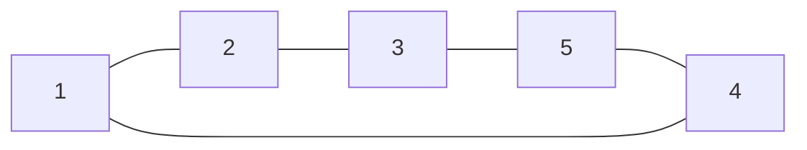
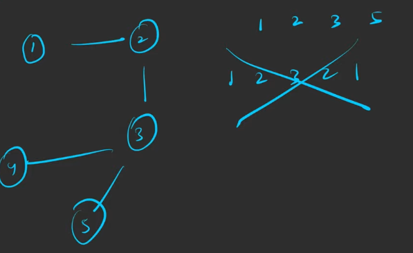
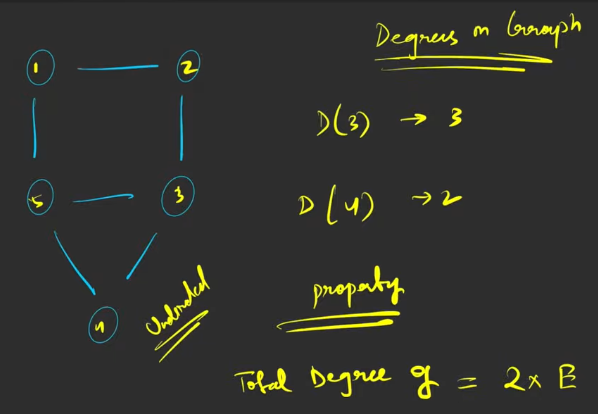
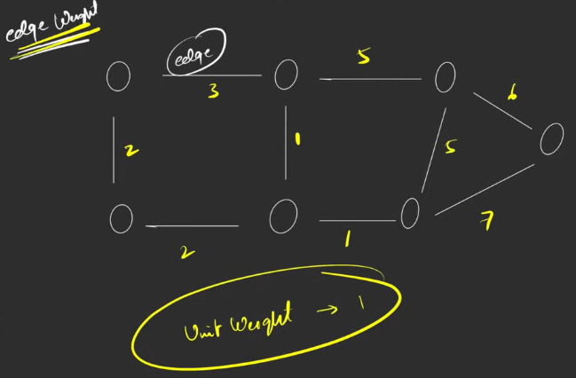

# 📊 Graph Data Structure – Introduction

This README explains the **basic concepts of Graphs in Data Structures**, including:

- Nodes (Vertices)
- Edges
- Directed & Undirected Graphs
- Cycles
- Paths
- Degree of Nodes
- In-degree & Out-degree
- Edge Weights

---

# 1️⃣ What is a Graph?

A **Graph** is a non-linear data structure used to represent relationships between objects.

A graph consists of:

- **Vertices (Nodes)** → Points in the graph
- **Edges** → Connections between nodes

Mathematically:

G = (V, E)

Where:

- **V** = Set of vertices (nodes)
- **E** = Set of edges (connections)

Example:

V = {1,2,3,4,5}  
E = {(1,2),(2,3),(3,5),(5,4)}

---

# 2️⃣ Undirected Graph

In an **Undirected Graph**, edges **do not have direction**.

If there is an edge between **u and v**, then:

u ↔ v

Meaning you can travel both directions.

### Diagram

---

# 3️⃣ Directed Graph (Digraph)

- In a Directed Graph, edges have a specific direction.

---

# 4️⃣ Cycle in Graph

- A Cycle occurs when:
- You start from a node
- Travel through edges
- Return to the same node

---

# 5️⃣ Directed Acyclic Graph (DAG)

- A Directed Acyclic Graph is a directed graph without cycles

---

# 6️⃣ Path in a Graph

A Path is a sequence of nodes where:

- Each adjacent pair has an edge
- No node appears twice

## 

# 7️⃣ Degree of a Node (Undirected Graph)

The degree of a node is the number of edges connected to it.

## 

# 8️⃣ In-Degree and Out-Degree (Directed Graph)

In directed graphs, nodes have two degrees.

**In-Degree:**
Number of incoming edges.

**Out-Degree:**
Number of outgoing edges.

---

# 9️⃣ Weighted Graph

In many problems, edges have weights.

### Weights can represent:

- **Distance**
- **Cost**
- **Time**
- **Network latency**
  

---

# 🔑 Key Concepts Summary

| Concept          | Meaning                                |
| ---------------- | -------------------------------------- |
| Graph            | Collection of nodes and edges          |
| Vertex (Node)    | Point in the graph                     |
| Edge             | Connection between nodes               |
| Undirected Graph | Edges have no direction                |
| Directed Graph   | Edges have direction                   |
| Cycle            | Path that starts and ends at same node |
| DAG              | Directed graph without cycles          |
| Path             | Sequence of connected nodes            |
| Degree           | Number of edges attached to a node     |
| In-degree        | Incoming edges                         |
| Out-degree       | Outgoing edges                         |
| Weighted Graph   | Edges have weights                     |
