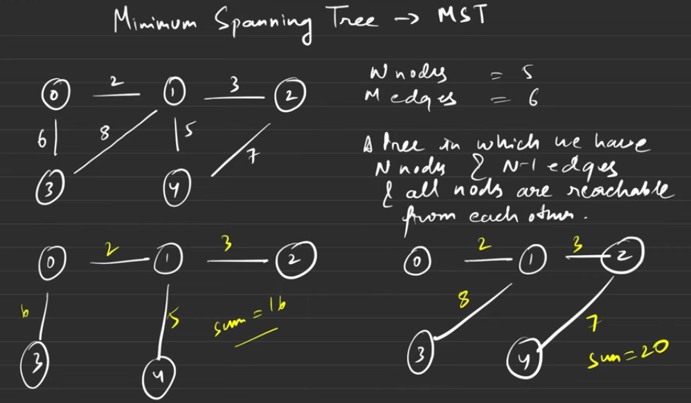
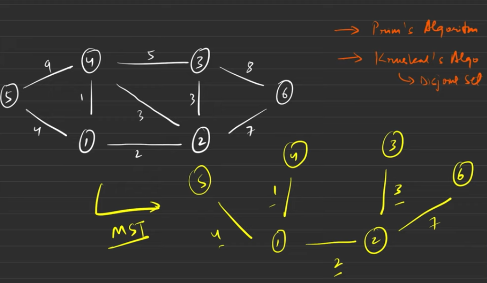

# Minimum Spanning Tree

A minimum spanning tree (MST) is a subset of the edges of a connected, edge-weighted undirected graph that connects all the vertices together, without any cycles and with the minimum possible total edge weight.

```
If the number of vertices in the graph is V,
then the number of edges in the minimum spanning tree will be V-1.
```

## Example



